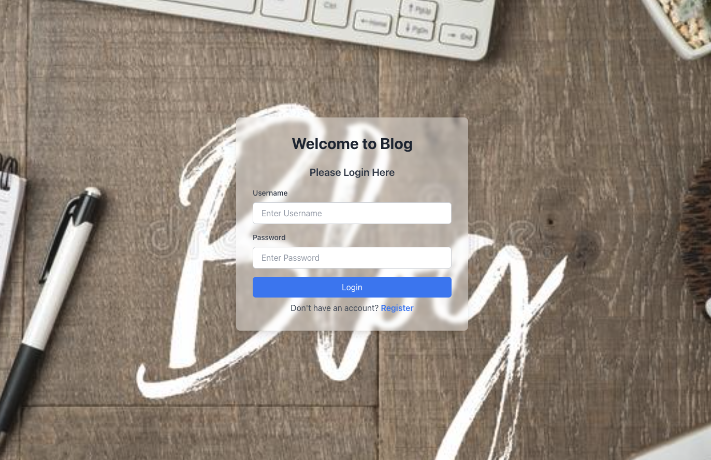
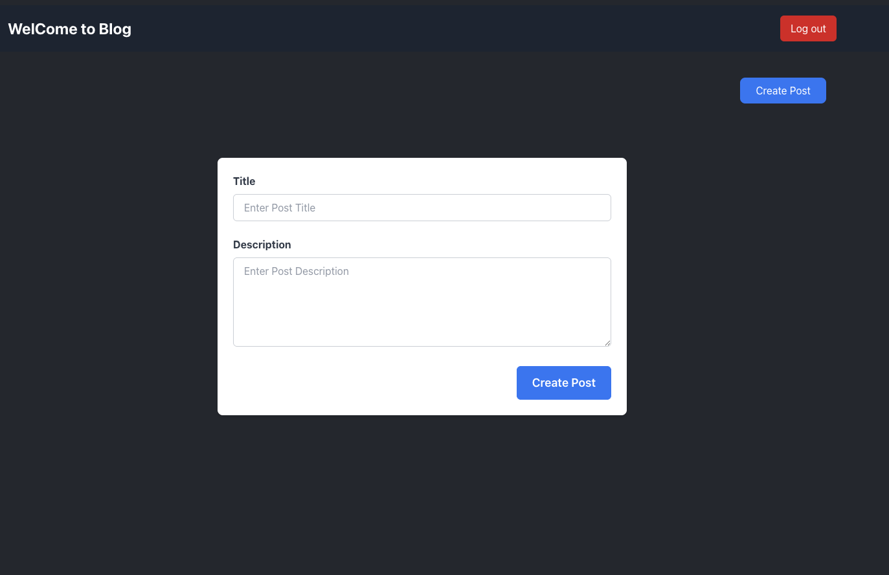

📝 Blog App
A full-stack blog application built with React (Vite) on the frontend and Django (Django Rest Framework - DRF) on the backend. The app allows users to create, read, update, and delete blog posts with authentication.

### 🚀 Features

✅ Full Authentication: User registration & JWT-based login/logout
✅ CRUD Operations: Create, Read, Update, and Delete blog posts
✅ API-Driven Architecture: Django backend serves a REST API
✅ Modern Frontend: React with Vite for fast performance
✅ Styled with Tailwind CSS: Clean and responsive UI
✅ Deployed on Render: Frontend and backend hosted separately

### 🛠 Technologies Used

📌 Frontend (React + Vite)
Vite – Lightning-fast build tool
React 19 – Component-based UI
React Router 7 – Client-side navigation
Tailwind CSS – Utility-first styling
Fetch API – API requests
JWT Authentication – Secure authentication

📌 Backend (Django + DRF)
Django – Web framework for the backend
Django Rest Framework (DRF) – API development
Simple JWT – Authentication using JWT tokens
SQLite/PostgreSQL – Database (depending on environment)

### 🏗 Installation Guide

🔹 1. Clone the Repository

git clone https://github.com/your-username/blog-app.git
cd blog-app
📡 Backend Setup (Django)
🔹 2. Create Virtual Environment & Install Dependencies

cd backend
python -m venv venv
source venv/bin/activate # For macOS/Linux
venv\Scripts\activate # For Windows
pip install -r requirements.txt
🔹 3. Run Migrations & Start Django Server

python3 manage.py makemigrations
python3 manage.py migrate
python3 manage.py runserver
✅ Backend will be running at: https://jsreactdjango-blogapp.onrender.com

🎨 Frontend Setup (React + Vite)
🔹 4. Install Dependencies

cd frontend
npm install
🔹 5. Configure Environment Variables
Create a .env file in the frontend directory and set:

### VITE_API_URL=https://jsreactdjango-blogapp.onrender.com

🔹 6. Start the Frontend

npm run dev
✅ Frontend will be running at: http://localhost:5173

### 🖥 API Endpoints

Method Endpoint Description

# POST /api/auth/login/ Login (JWT)

# POST /api/auth/register/ Register

# GET /api/articles/ Get all posts

# POST /api/articles/ Create post (Auth required)

# PUT /api/articles/:id/ Update post (Auth required)

# DELETE /api/articles/:id/ Delete post (Auth required)

### 🌍 Deployment (Render)

🔹 1. Deploy Backend to Render

# 1️⃣ Push the project to GitHub

# 2️⃣ Create a new service on Render

# 3️⃣ Select your backend repository

# 4️⃣ Set Build Command:

pip install -r requirements.txt && python manage.py migrate

# 5️⃣ Set Start Command:

gunicorn backend.wsgi:application

# 6️⃣ Add Environment Variables:

DJANGO_SECRET_KEY=<your-secret-key>
ALLOWED_HOSTS=your-backend-url.render.com
DATABASE_URL=<your-database-url>

🔹 2. Deploy Frontend to Render

# 1️⃣ Create a new service on Render

# 2️⃣ Select your frontend repository

# 3️⃣ Set Build Command:

npm install && npm run build

# 4️⃣ Set Start Command:

npx serve -s dist

# 5️⃣ Add Environment Variables:

VITE_API_URL=https://your-backend-url.render.com
🏆 Conclusion
Your React + Django Blog App is now live! 🎉

### 🤝 Contributing

Pull requests are welcome. For major changes, open an issue first.

### 📜 License

MIT License.
